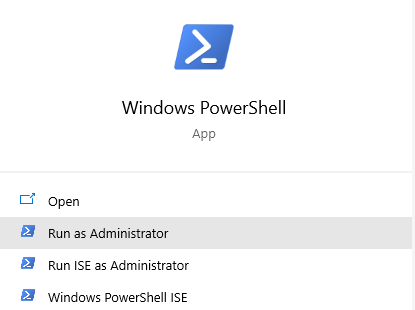
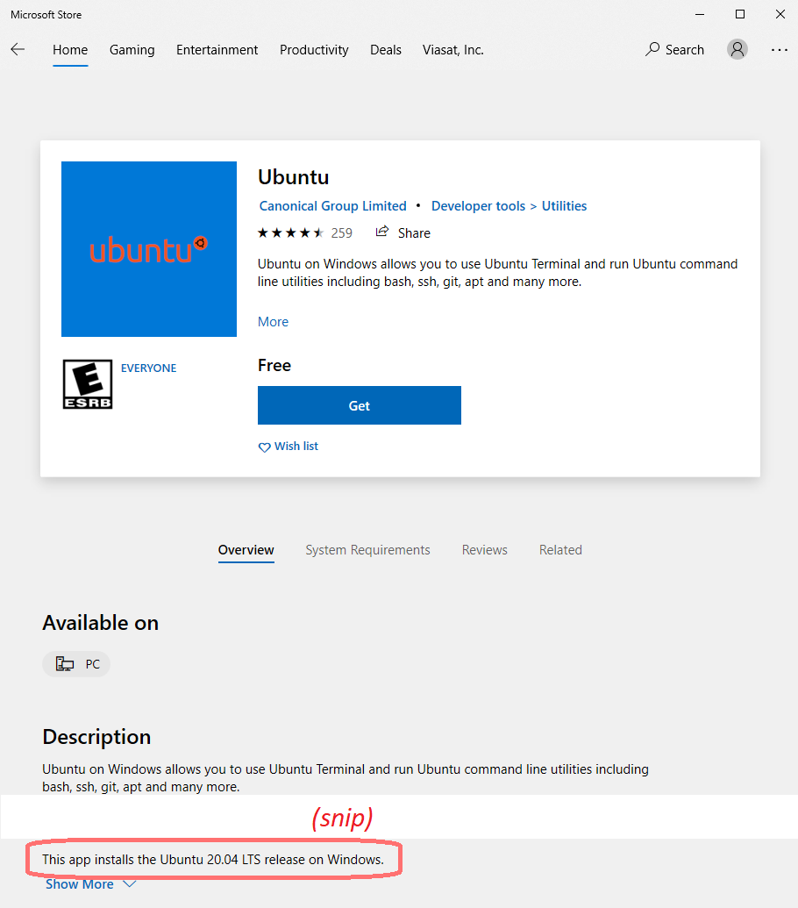

[Back to weekly syllabus](Fall_2021_syllabus.html)

<br />

# High Level Overview

1. Get a Linux machine setup on your computer
2. Install pre-requisite packages
3. SSH into machine
4. Pull and make DANE
5. Run Dane Test

<br />

# Step 1: Get Linux Machine

Only follow the directions for your machine. If you already have a Linux machine you have root privileges on, and you don’t mind installing Docker on it, you can skip this step.

## Windows: Installing WSL2
Following the direction from here: 
[https://docs.microsoft.com/en-us/windows/wsl/install-win10](https://docs.microsoft.com/en-us/windows/wsl/install-win10), relevant steps 
reproduced below:
1. Run all commands in PowerShell, run as Administrator. `cmd` is not the same and will not work. <br />
2. Try: `wsl –install` <br /> If that works, skip to [step 8](#step1-8). <br />If you get an error message, we’ll have to do it manually. Follow steps 3-6. Hint: make sure Windows is at least version 2004 and you install the lastest security patch and there is a good chance this auto install will work!
3. `dism.exe /online /enable-feature /featurename:Microsoft-Windows-
Subsystem-Linux /all /norestart`
4. `dism.exe /online /enable-feature /featurename:VirtualMachinePlatform /all /norestart`
5. Reboot
6. Install update package from 
[https://wslstorestorage.blob.core.windows.net/wslblob/wsl_update_x64.msi](https://wslstorestorage.blob.core.windows.net/wslblob/wsl_update_x64.msi)
7. Install Ubuntu 20.04 LTS from Microsoft Store (it is free)  Note:  Installing the Ubuntu application will install the correct version. <br />
8. <span id="step1-8" />Launch and setup username and password that you’ll remember

### Note about WSL2
> As best I can tell, WSL2 does not support Linux’s init system. I haven’t been able to  figure out how start services on bootup. Once you have Docker and SSH server installed in Step 2, you will need you will need to run these commands every time you boot the Ubuntu machine: <br />
`sudo dockerd &` <br />
`sudo service ssh start`

## Mac: Installing Virtual Box
1. [https://www.virtualbox.org/wiki/Downloads](https://www.virtualbox.org/wiki/Downloads)
2. Ubuntu ISO: [https://ubuntu.com/download/server](https://ubuntu.com/download/server) -> Option 2 Manual server installation -> Download Ubuntu Server 20.04 LTS
3. Create a new machine (defaults are fine)
4. Settings
5. Storage->Controller: IDE->Empty
    - Click the CD icon (to the right of Optical Drive), choose a disk file, and select the Ubuntu ISO
6. Network
    - Verify Adapter 1 is attached to NAT
    - Adapter 2
      - Enable Network Adapter
      - Attached to: Host-only Adapter
7. Start Machine, install Ubuntu (make sure you create a user account with a 
password and remember the password)
8. Once fully installed, shut down machine
9. Settings->Storage->Controller: IDE->Disk Icon->Remove disk from virtual drive
10. Start machine


# Step #2: Install pre-requisite packages

In the virtual machine, run the following on the command line:
1. `sudo apt update`
2. `sudo apt upgrade`
3. `sudo apt install make docker.io docker-compose ssh`

<br />

# Step #3: SSH into Machine

It will be useful to have multiple command prompts available to the virtual machine.
On Windows and Mac hosts, it is crucial to be able to SSH into the machine. On a Linux host, you may simply use multiple command windows.

## Windows: PUTTY and WinSCP

### Install
1. If you already have an SSH client and SFTP client on your machine that you like, you may use those and not bother with steps 2 and 3
2. Install Putty (SSH Client): 
[https://www.chiark.greenend.org.uk/~sgtatham/putty/latest.html](https://www.chiark.greenend.org.uk/~sgtatham/putty/latest.html)
3. Install WinSCP (SFTP Client): [https://winscp.net/eng/download.php](https://winscp.net/eng/download.php)

### Connect
1. Within the Ubuntu virtual machine, run “`ip addr | grep eth0`”
2. Find the IP address in the output (it will be the number after `inet` starting with `172`, and before the ‘`/20`’: <br />
```
4: eth0: <BROADCAST,MULTICAST,UP,LOWER_UP> mtu 1500 qdisc mq state UP group default qlen 1000
    inet 172.21.144.180/20 brd 172.21.159.255 scope global eth0
```
3. Make sure you have started SSH service on virtual machine (`sudo service ssh 
start`)
4. Launch PUTTY and put in the VM’s IP address
5. When prompted, put in the username and password that you used when 
setting up the VM
6. You can repeat steps 4 and 5 as many times as you would like. However, 
every time you boot the VM, you’ll need to start from step 1, as the IP 
address will change on every boot.


### Transfer Files
1. Use WinSCP and the IP address found in steps 1-3 of the above section.

## Mac: Terminal Commands

### Connect

1. Within the Ubuntu virtual machine, run `ip addr | grep enp0`
2. Look for the IP address: <br />
```
[root@fedora ~]# ip addr | grep enp0
2: enp0s3: <BROADCAST,MULTICAST,UP,LOWER_UP> mtu 1500 qdisc fq_codel state UP group default qlen 1000
    inet 10.0.2.15/24 brd 10.0.2.255 scope global dynamic noprefixroute enp0s3
3: enp0s8: <BROADCAST,MULTICAST,UP,LOWER_UP> mtu 1500 qdisc fq_codel state UP group default qlen 1000`
    inet 192.168.56.102/24 brd 192.168.56.255 scope global dynamic noprefixroute enp0s8
```
3. Use the IP address that starts with “192.168” (in this case, 192.168.56.102, 
but it will probably be different in your case)
4. Open a terminal window in the Mac OS
5. `ssh <username of Linux VM>@<IP address>`
    * For example: `ssh charlie@192.168.56.102`
6. You can repeat steps 4 and 5 as many times as you would like. Most likely, 
the IP address will keep working forever, but if you have problems, find the IP
address again by following steps 1-3.

### Transfer Files
1. Open a terminal window in the Mac OS
2. `sftp <username of Linux VM>@<IP address>`
    * For example: `sftp charlie@192.168.56.102`
3. Use `cd` and `ls` to navigate the Linux VM’s directory structure
4. Get `get <filename>` to grab files from the Linux VM


<br />

# Step #4: Installing DANE

1. `git clone https://github.com/Viasat/dane.git --recursive`
    * The `--recursive` is extremely important!
2. Change directory to the `dane` directory
3. `sudo make build`
    * Give this about 5 minutes to complete, depending on Internet speed. It needs to download ~300 MB from the Internet.

<br />

# Step #5: Run DANE Test
1. Change directory to the dane directory
2. `sudo make up`
3. Wait ~8 minutes for test to complete
4. Launch a new SSH session to Linux VM (the one that ran step #2 will be blocked)
5. Change directory to the dane directory
6. `sudo make stop`


<br />

#  Step 6:  Analysis Assignment

1. Generate time series graphs for two runs of DANE.
2. Create a short (no more than 5 slides) presentation showing your graphs.  Annotate them to highlight any interesting observations you have about the data.
3. Identity two or more candidate features you might think about using for a binary classifier
